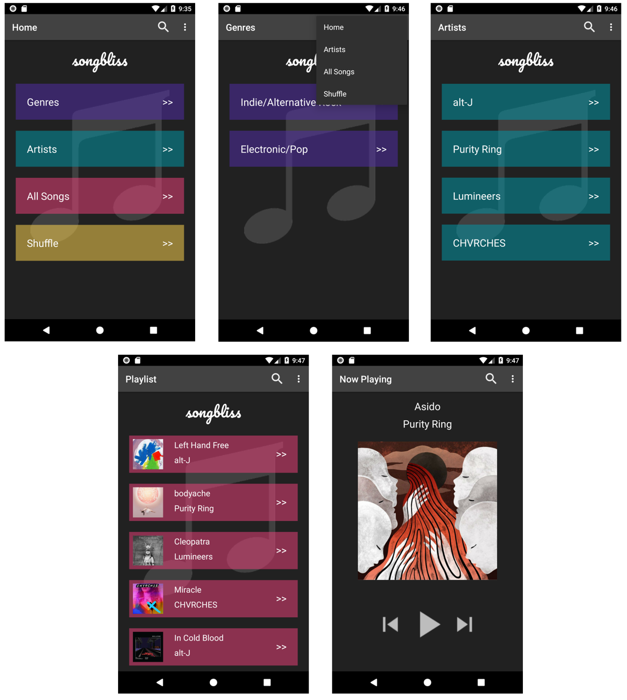

## Grow With Google Android Basics Nanodegree: PROJECT 4
# Songbliss - Music Player App

Used **API 27: Android 8.1 (Oreo)**

## Screenshots

## About
This project is a music player structure app that displays music options from a user library, with ability to sort by genre and artist.

## Features
- Use of ArrayList to retrieve and display information to a Listview.
- Use of OnClickListeners and explicit intents to link between activities within the app.
